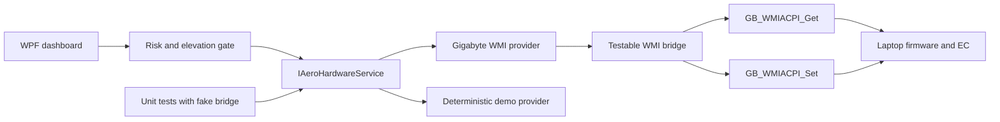

# AeroControl

[](https://github.com/lavann/AeroControl/actions/workflows/ci.yml)
[](LICENSE)
[](#requirements)
[](https://dotnet.microsoft.com/download/dotnet/8.0)

AeroControl is a lightweight, open-source .NET desktop utility for Gigabyte AERO laptops. It talks directly to firmware-provided WMI classes, without redistributing or loading proprietary Control Center binaries.

> [!CAUTION]
> AeroControl is unofficial hardware-control software. Firmware writes can cause overheating, instability, data loss, or hardware damage when used incorrectly or on unsupported systems. Use it entirely at your own risk, monitor temperatures, and read [DISCLAIMER.md](DISCLAIMER.md) before enabling writes.


## Project status

Version 0.1 is a **cooling-first MVP**, not yet a complete replacement for every Gigabyte Control Center module. The architecture is intentionally capability-driven so model support and additional controls can be added without bundling vendor software.

Currently implemented:

- CPU and GPU temperature monitoring
- Independent Fan 1 and Fan 2 RPM monitoring
- CPU and GPU fan-duty monitoring
- Fan health and automatic/fixed mode reporting
- Automatic, 70%, 80%, 100%, and custom 30-100% fan control
- Automatic firmware-mode restoration on exit
- Runtime firmware capability discovery
- Administrator-access detection and restart
- Versioned, persisted hardware-risk acknowledgement before the first write
- Deterministic demo mode and in-app screenshot capture
- No telemetry, cloud service, advertising, or vendor binary redistribution

## Compatibility

| Model | Firmware interface | Status |
| --- | --- | --- |
| Gigabyte AERO 15-SA / P75SA | `GB_WMIACPI_Get`, `GB_WMIACPI_Set` | Verified on BIOS FB09 |
| Other Gigabyte/AORUS laptops exposing the same methods | Capability-detected at runtime | Experimental; writes are unverified |
| Systems without Gigabyte WMI ACPI classes | None | Monitoring and writes unavailable |

See [docs/compatibility.md](docs/compatibility.md) for the verified duty values, observed RPMs, and safe model-reporting instructions.

## Requirements

- Windows 10 version 1809 or later
- [.NET 8 Desktop Runtime](https://dotnet.microsoft.com/download/dotnet/8.0)
- Compatible Gigabyte firmware and WMI/ACPI driver already installed
- Administrator access for firmware reads or writes when required by the driver

Do not run AeroControl and Gigabyte Control Center fan control at the same time. Competing utilities can overwrite each other's settings.

## Build and run

```powershell
git clone https://github.com/lavann/AeroControl.git
Set-Location AeroControl
dotnet restore
dotnet build AeroControl.sln -c Release
dotnet run --project src/AeroControl/AeroControl.csproj -c Release
```

The app starts without forcing elevation. If the firmware provider denies access, use **Restart as administrator** inside AeroControl. Read-only UI access does not accept the hardware disclaimer; the acknowledgement is required immediately before the first write.

Run without hardware access:

```powershell
dotnet run --project src/AeroControl/AeroControl.csproj -- --demo
```

Regenerate the checked-in screenshot from the real WPF window:

```powershell
dotnet run --project src/AeroControl/AeroControl.csproj -- --demo --capture docs/images/dashboard.png
```

## Architecture



The core library owns models, duty encoding, capability checks, and firmware sequences. The WPF project owns presentation, elevation, settings, and human acknowledgement. Tests substitute a fake bridge, so automated builds never write to hardware.

## Safety invariants

- No write occurs before explicit risk acceptance.
- Fixed duty is constrained to the vendor UI's observed 30-100% range.
- Fan presets use the verified raw mapping: 70% = 160, 80% = 183, 100% = 229.
- Both system and GPU fan paths are updated as one operation.
- Automatic mode remains available and is restored on exit by default.
- Unsupported methods are detected before a write is attempted.
- Proprietary Gigabyte DLLs, drivers, firmware, and source are not part of this repository.

## Roadmap

- System toggles: camera, touchpad, Windows key, Wi-Fi, and Bluetooth
- Battery health and model-validated charge limits
- Performance and power profiles
- Keyboard backlight and RGB controls through documented/model-validated interfaces
- Tray mode, startup profiles, and temperature history
- Signed release artifacts and an opt-in updater
- Community model packs backed by readback tests and compatibility evidence

A control is not added merely because a WMI method exists. New writes require model evidence, a reversible path, readback where available, tests, and a clear UI safety boundary.

## Contributing

Read [CONTRIBUTING.md](CONTRIBUTING.md) before proposing model support. Hardware reports must omit serial numbers and other identifiers. Do not submit proprietary binaries, firmware, or copied vendor code.

## License

AeroControl is available under the [MIT License](LICENSE). The software is provided **AS IS**, without warranty. The additional [hardware-control disclaimer](DISCLAIMER.md) explains the practical risks but does not replace the license.

GIGABYTE and AORUS are trademarks of their respective owner. This project is not affiliated with or endorsed by GIGA-BYTE Technology Co., Ltd.
