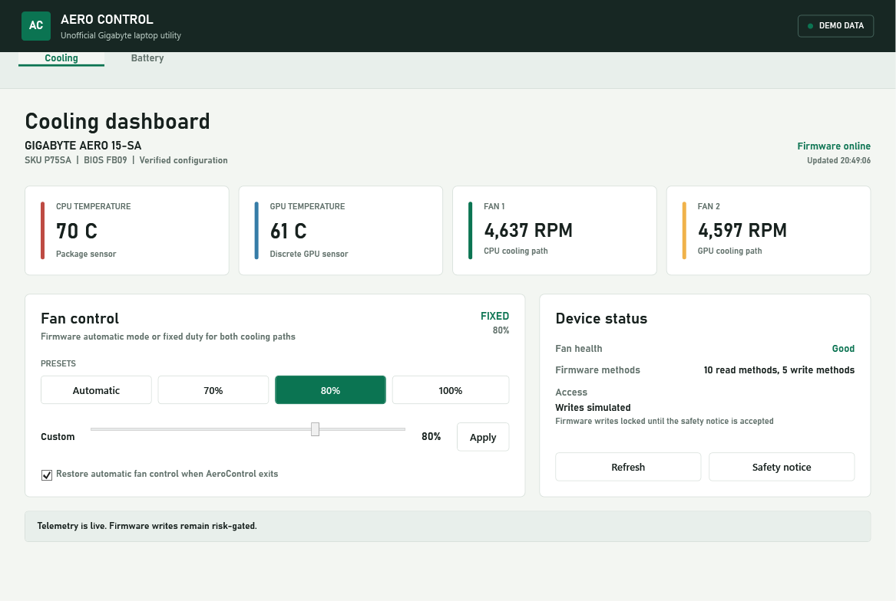
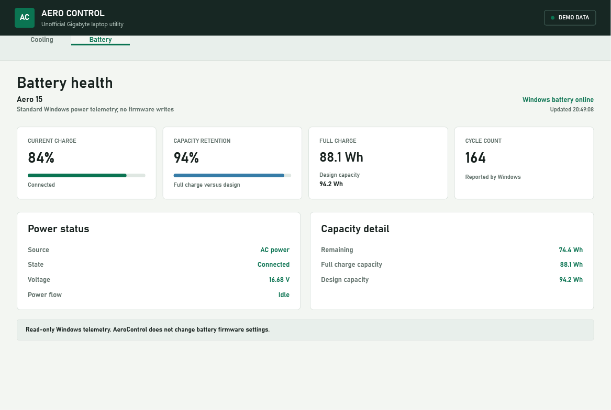
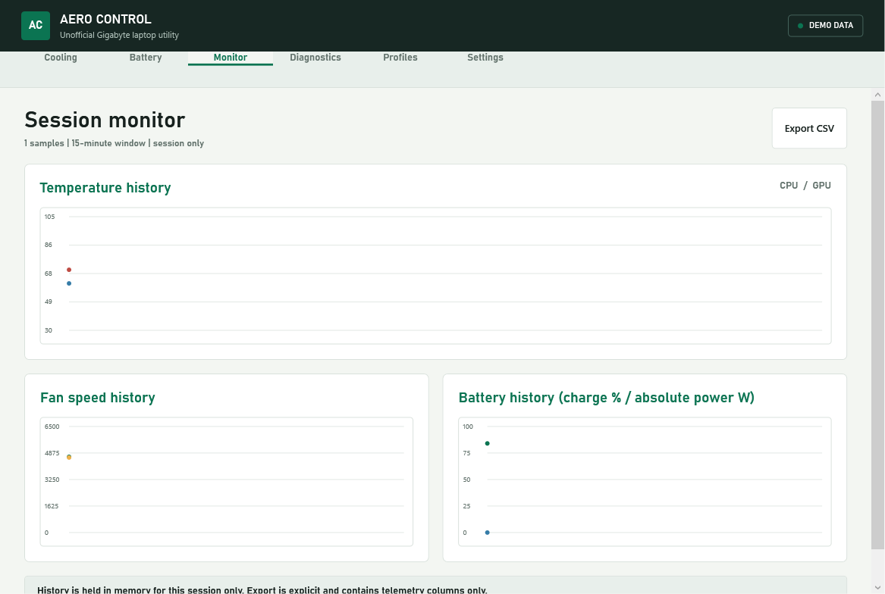
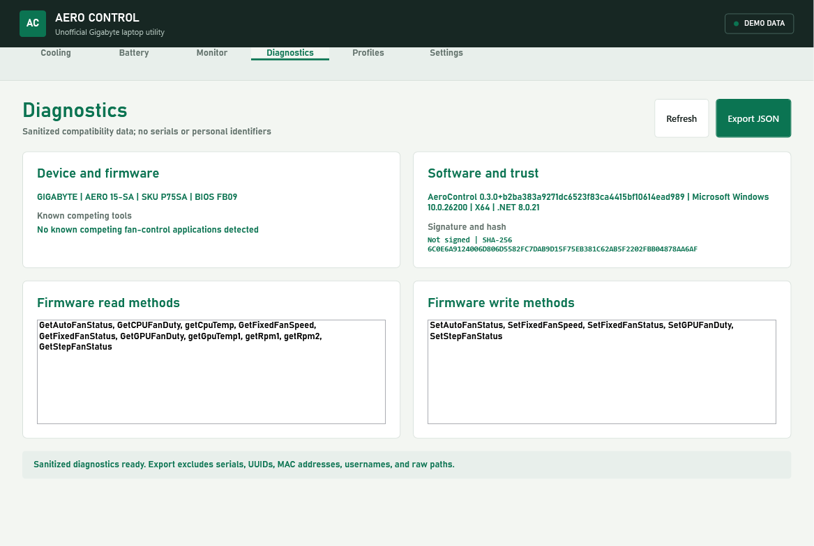
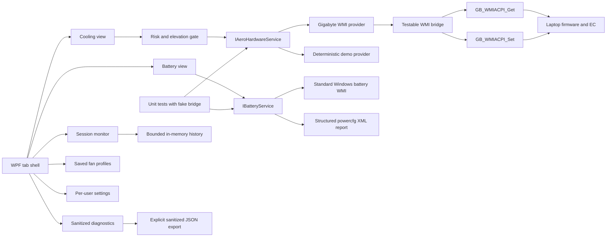

# AeroControl

[](https://github.com/lavann/AeroControl/actions/workflows/ci.yml)
[](LICENSE)
[](#requirements)
[](https://dotnet.microsoft.com/download/dotnet/8.0)

AeroControl is a lightweight, open-source .NET desktop utility for Gigabyte AERO laptops. It talks directly to firmware-provided WMI classes, without redistributing or loading proprietary Control Center binaries.

> [!CAUTION]
> AeroControl is unofficial hardware-control software. Firmware writes can cause overheating, instability, data loss, or hardware damage when used incorrectly or on unsupported systems. Use it entirely at your own risk, monitor temperatures, and read [DISCLAIMER.md](DISCLAIMER.md) before enabling writes.









## Project status

Version 0.4 is a **cooling, battery, monitoring, diagnostics, and compatibility-reporting preview**, not yet a complete replacement for every Gigabyte Control Center module. Cooling remains the default launch tab unless the user explicitly enables remembered navigation.

Currently implemented:

- CPU and GPU temperature monitoring
- Independent Fan 1 and Fan 2 RPM monitoring
- Fixed system-fan duty and GPU fan-duty monitoring when supported by firmware
- Fan health and automatic/fixed mode reporting
- Automatic, 70%, 80%, 100%, and custom 30-100% fan control
- Automatic firmware-mode restoration on exit
- Read-only battery charge, power-state, voltage, capacity-retention, and cycle telemetry
- Standard Windows battery APIs only; the Battery tab performs no firmware writes and requires no elevation
- Session-only Monitor charts with explicit CSV export
- Versioned, evidence-only compatibility-report JSON with bounded read-only telemetry and no serials, UUIDs, MAC addresses, usernames, or raw paths
- Local sustained temperature/fan-stall notifications that never change hardware settings
- Named fan profiles reusing the existing verified fan-control path
- Per-user settings, optional notification-area behavior, and reversible sign-in startup
- Optional per-user setup to `%LOCALAPPDATA%\AeroControl`; the portable executable remains supported
- Runtime firmware capability discovery
- Administrator-access detection and restart
- Versioned, persisted hardware-risk acknowledgement before the first write
- Deterministic demo mode and in-app screenshot capture
- No telemetry, cloud service, advertising, or vendor binary redistribution

## Compatibility

| Model | Firmware interface | Status |
| --- | --- | --- |
| Gigabyte AERO 15-SA / P75SA | `GB_WMIACPI_Get`, `GB_WMIACPI_Set` | Verified on BIOS FB09 |
| Other Gigabyte/AORUS laptops exposing the same methods | Capability-detected at runtime | Read-only; writes disabled until exact configuration verification |
| Systems without Gigabyte WMI ACPI classes | None | Monitoring and writes unavailable |

See [docs/compatibility.md](docs/compatibility.md) for the verified duty values, observed RPMs, and the versioned read-only compatibility-report workflow. Reports are evidence only and never enable firmware writes automatically.

## Windows publisher and SmartScreen status

Current GitHub release executables are **unsigned**, so Windows can show both an **Unknown publisher** UAC prompt and a Microsoft Defender SmartScreen reputation warning. This is expected for the current artifact and is not, by itself, a malware detection. Verify the SHA-256 listed on the release page and never disable Defender to run AeroControl.

Public signing requires a verified publisher identity. The recommended path is Microsoft Artifact Signing with a Public Trust certificate profile and GitHub OIDC; signing removes the anonymous publisher identity, while SmartScreen also considers file, URL, app, and certificate reputation. See [docs/code-signing.md](docs/code-signing.md) for the researched implementation plan and alternatives.

## Requirements

- Windows 10 version 1809 or later
- [.NET 8 Desktop Runtime](https://dotnet.microsoft.com/download/dotnet/8.0)
- Compatible Gigabyte firmware and WMI/ACPI driver already installed
- Administrator access for firmware reads or writes when required by the driver

Do not run AeroControl and Gigabyte Control Center fan control at the same time. Competing utilities can overwrite each other's settings.

## Build and run

```powershell
git clone https://github.com/lavann/AeroControl.git
Set-Location AeroControl
dotnet restore
dotnet build AeroControl.sln -c Release
dotnet run --project src/AeroControl/AeroControl.csproj -c Release
```

## Install options

The release ZIP contains:

- `AeroControl.exe` for portable use
- `AeroControl.Setup.exe` for per-user installation
- `LICENSE` and `DISCLAIMER.md`

Run `AeroControl.Setup.exe` to install the app to:

```text
%LOCALAPPDATA%\AeroControl
```

Setup does not request administrator access. Its optional **Launch AeroControl when I sign in** checkbox writes only the current-user `HKCU\Software\Microsoft\Windows\CurrentVersion\Run\AeroControl` value. Setup can update or remove the installed payload and deletes that startup value during removal only when it points to the installed executable. App settings are stored separately under LocalAppData and are not silently deleted by setup.

The app starts without forcing elevation. If the firmware provider denies access, use **Restart as administrator** inside AeroControl. Read-only UI access does not accept the hardware disclaimer; the acknowledgement is required immediately before the first write.

Run without hardware access:

```powershell
dotnet run --project src/AeroControl/AeroControl.csproj -- --demo
```

Regenerate the checked-in screenshot from the real WPF window:

```powershell
dotnet run --project src/AeroControl/AeroControl.csproj -- --demo --view cooling --capture docs/images/dashboard.png
dotnet run --project src/AeroControl/AeroControl.csproj -- --demo --view battery --capture docs/images/battery.png
dotnet run --project src/AeroControl/AeroControl.csproj -- --demo --view monitor --capture docs/images/monitor.png
dotnet run --project src/AeroControl/AeroControl.csproj -- --demo --view diagnostics --capture docs/images/diagnostics.png
```

## Architecture



The core library owns models, duty encoding, capability checks, and firmware sequences. The WPF project owns presentation, elevation, settings, and human acknowledgement. Tests substitute a fake bridge, so automated builds never write to hardware.

## Safety invariants

- No write occurs before explicit risk acceptance.
- Live risk acceptance is bound to the exact manufacturer/model/SKU/BIOS configuration; demo acceptance is never persisted.
- Firmware writes are allowlisted to the exact verified configuration, not enabled by method-name detection alone.
- Fixed duty is constrained to the vendor UI's observed 30-100% range.
- Fan presets use the verified raw mapping: 70% = 160, 80% = 183, 100% = 229.
- System and GPU fan setters run in one serialized sequence; mode state and fixed system duty are read back, and any detected partial failure rolls back to verified automatic mode. The verified firmware's GPU-duty getter is unusable, so a silent GPU setter no-op cannot be independently read back.
- Automatic mode remains available and is restored on exit by default.
- Unsupported methods are detected before a write is attempted.
- Proprietary Gigabyte DLLs, drivers, firmware, and source are not part of this repository.

## Roadmap

- System toggles: camera, touchpad, Windows key, Wi-Fi, and Bluetooth
- Model-validated battery charge limits
- Performance and power profiles
- Keyboard backlight color controls and named color profiles through documented, model-validated interfaces
- Artifact-signed release binaries and an opt-in updater
- Community model packs backed by readback tests and compatibility evidence

A control is not added merely because a WMI method exists. New writes require model evidence, a reversible path, readback where available, tests, and a clear UI safety boundary.

## Contributing

Read [CONTRIBUTING.md](CONTRIBUTING.md) before proposing model support. Use the reviewed Diagnostics JSON with the [hardware-support form](https://github.com/lavann/AeroControl/issues/new?template=hardware-support.yml); reports must omit serial numbers and other identifiers and cannot grant write support. Do not submit proprietary binaries, firmware, or copied vendor code.

## License

AeroControl is available under the [MIT License](LICENSE). The software is provided **AS IS**, without warranty. The additional [hardware-control disclaimer](DISCLAIMER.md) explains the practical risks but does not replace the license.

GIGABYTE and AORUS are trademarks of their respective owner. This project is not affiliated with or endorsed by GIGA-BYTE Technology Co., Ltd.
